## Hi there 👋

<div align="center">
  
  <br>
  
  <p><i>"A tecnologia é o meio, mas a preservação e a arquitetura são o legado."</i></p>
</div>

---

### 🧠 Trajetória & Visão

Atuo no ecossistema de TI desde **2000**, uma jornada que começou no hardware e suporte e evoluiu para a arquitetura de sistemas complexos. Com passagem pelo mercado exterior em suporte a **APIs em Big Techs**, hoje foco minha energia como **Fundador** do meu próprio negócio e, simultaneamente, como **Acadêmico de Engenharia de Software**, construindo soluções que unem a robustez do legado com a agilidade do moderno.

Sou um defensor do código limpo e da infraestrutura resiliente, entendendo que cada linha escrita deve servir a um propósito maior: a continuidade e a escalabilidade da operação.

---

### 🚂 Além do Código: Memória & Preservação

Nem tudo na vida é bit e byte. Minha paixão reside na história e no **ferreomodelismo**, onde aplico a mesma precisão da engenharia para preservar a memória ferroviária:

- 🚂 **Organizador:** Encontro Mineiro de Ferreomodelismo.
- 🏛️ **Preservação:** Membro ativo da **ALZL** e **ACBF**, associações dedicadas à cultura e memória ferroviária.
- 🤝 **Voluntariado:** Atuante em obras de resgate cultural, garantindo que o passado ilumine o futuro.

---

### 🚀 Radar Técnico

- 🔭 **Foco:** Evolução de produtos próprios e arquiteturas de alta disponibilidade.
- 🌱 **Aprendizado:** Observabilidade de sistemas distribuídos e novas fronteiras em Go/Python.
- 💬 **Troca de ideias:** APIs, arquitetura de sistemas, história ferroviária e o impacto da tecnologia na cultura.
- ⚡ **Fato curioso:** Aplico a lógica de sistemas complexos tanto no Kubernetes quanto na malha ferroviária do meu modelismo.

---

### 💻 Arsenal Tecnológico


---

### 🕵️ `GET /api/v1/identity/handshake`

Para parcerias, networking ou um bom papo sobre ferreomodelismo, decifre o handshake:
```Go

// Response representation in Go
type Response struct {
    Status  int    `json:"status"`
    Message string `json:"message"`
    Data    struct {
        Identity string `json:"identity"`
        Contacts struct {
            Primary   string `json:"phone_primary"`
            Secondary string `json:"phone_secondary"`
            Email     string `json:"email_logic"`
        } `json:"contacts"`
    } `json:"data"`
}
```
```JSON

{
  "status": 200,
  "message": "Handshake successful. Welcome, human.",
  "data": {
    "identity": "Cacov",
    "contacts": {
      "phone_primary": "+55 (bits_do_IPv4) (√81) (2222 * 4)-(0234)",
      "phone_secondary": "+55 (2⁵) (3²) (8800 + 8)-(6000 + chmod_all_permissions)",
      "email_logic": "cleimarvidall @ [serviço_de_email_da_empresa_que_criou_o_Go].com"
    }
  }
}
```
